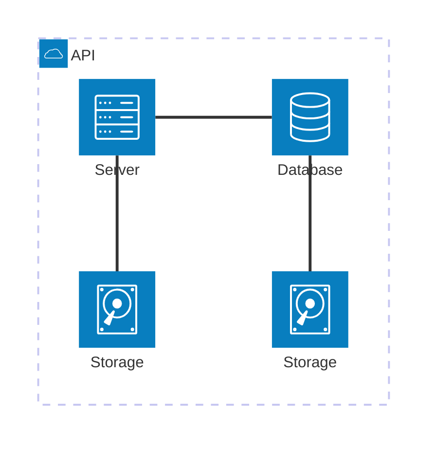

# Architecture Overview

This project implements a two-phase web scraping pipeline using AWS Lambda functions written in Node.js and Perl. The system is designed to handle dynamic, JavaScript-rendered pages and convert them into structured data using a custom Lambda runtime.

## High-Level Flow

## Components
1. **Node.js Lambda: Fetcher**
    - Uses headless Chromium (via Puppeteer) to render JavaScript-heavy web pages
    - Stores fully rendered HTML in a raw S3 bucket

2. **S3 (Raw HTML Bucket)**
    - Serves as the interface between the fetch and scrape phases

3. **Perl Lambda: Scraper**
    - Custom runtime implemented using a bootstrap script
    - Uses Mojo::DOM to parse HTML and extract structured job listings

